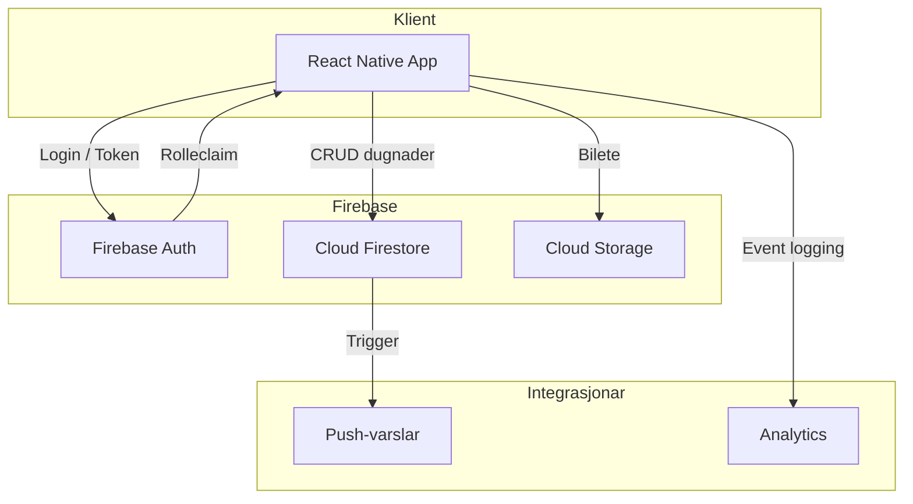
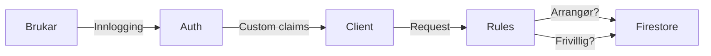

# DugnadHub – Teknisk tilråding

*Kandidatnummer: <sett inn kandidatnummer>*

## 1. Innleiing

Denne rapporten vurderer korleis DugnadHub, ein kryssplattform applikasjon for lokal dugnadsorganisering, best kan planleggast og utviklast. Som teknisk leiar er målet å foreslå ein balansert strategi som støttar rask lansering, sikker drift og langsiktig vidareutvikling. Vurderingane byggjer på kravspesifikasjonen, eigne erfaringar frå liknande prosjekt og forskings- og bransjekjelder.

## 2. Marknads- og brukargrunnlag

Digital dugnadsdeltaking krev høg mobiltilgjenge. Tal frå Telenor viser at 97 % av nordmenn eig smarttelefon, og at bruken er jamt fordelt mellom iOS og Android, sjølv om Android har svakt overtak i marknadsdel[1]. Ei kryssplattformløysing må såleis levere lik funksjonalitet på begge økosystem. Norsk Medietilsyn sine undersøkingar stadfestar at mobil er primærkanal for digitale aktivitetar på tvers av aldersgrupper[2]. DugnadHub bør derfor prioritere responsiv mobiloppleving og støtte deling i sosiale medium.

## 3. Teknologival og arkitektur

### 3.1 Frontend

**React Native med Expo** vert anbefalt for å levere raskt til både iOS og Android frå same kodebase. Expo tilbyr ferdigkonfigurerte byggeløp, OTA-oppdateringar og integrasjonar mot kamera, meldingsvarslar og filopplasting – sentralt for dugnadsbilete og kommunikasjon[3]. TypeScript gir sterk typing og lågare risiko for regressjon.

### 3.2 Backend og data

**Firebase** vert valt som Backend-as-a-Service. Firebase Authentication gjer det enkelt å implementere e-post-/passord-innlogging og eventuelle sosiale login-skjema. Firestore (NoSQL) støttar sanntidsoppdateringar av deltakarar og kapasitet, medan Cloud Storage handterer bilete. Google Cloud sin infrastruktur oppfyller ISO 27001 og har innebygde sikkerheitsmekanismar, noko som reduserer DevOps-arbeid[4].

### 3.3 Systemarkitektur

Arkitekturen legg opp til ein modulær klient med eigne lag for datahenting (hooks) og visning (skjermar/komponentar). Firebase vert autoritativ datakjelde, medan funksjonar som push-varslar og analytics kan koplast til etter behov.

## 4. Funksjonell tilnærming

### 4.1 Kjernefunksjonar

1. **Autentisering** – E-post/passord som minimum. Ved seinare revisjon kan Google Sign-In aktiverast for lågare terskel.
2. **Liste og detaljvising** – Firestore queryar filtrert på kommande arrangement. Realtime-listener oppdaterer kapasitet når deltakarar melder seg på.
3. **Påmelding** – Cloud Functions kan sikre at deltakargrensa ikkje vert overskriden, og oppdatere profilstatistikk.
4. **Oppretting av dugnad** – Rollebasert tilgang (arrangør vs. frivillig) med klientvalidering gjennom Zod-skjema, og biletopplasting til Storage.
5. **Kommunikasjon** – Kommentarar og anerkjenningar i underkolleksjonar («/comments») for å stimulere samarbeid.

### 4.2 Tilgangsstyring

Roleclaims i Firebase Auth (admin SDK) skil frivillige og arrangørar. Arrangørar får skrive- og slette-rettar på eigne dokument i Firestore via sikkerheitsreglar:

Reglane sjekkar `request.auth.token.role == 'organiser'` for CRUD på `dugnads/{id}` og at `resource.data.organiserId == request.auth.uid` ved oppdatering. Frivillige har berre lese-rettar og kan skrive til påmeldings-arrayet via `arrayUnion` med sikker kontingent, eventuelt med Cloud Function som transaksjonskontroll.

## 5. Datamodell

Firestore-dokumentstruktur:

- `dugnads/{dugnadId}`: metadata, deltakar-array, kapasitet, tidsstempel.
- `dugnads/{dugnadId}/comments/{commentId}`: meldingar, biletreferansar.
- `profiles/{userId}`: namn, bilde, rolle, statistikk.
- `notifications/{userId}`: pending push-varslar.

Denne modellen støttar fleksibel utviding (t.d. gamification). Den er schema-light, men TypeScript-modellar og validering på klienten sikrar konsistens.

## 6. Ikkje-funksjonelle krav

### 6.1 Sikkerheit

- Firebase Auth multi-faktor som opsjon for arrangørar.
- Firestore-reglar med dokumentbasert autorisasjon.
- OWASP Mobile Application Security Verification Standard (MASVS) gjev sjekkliste for sikker mobilkode (lagring av nøklar, sikring mot reverse engineering)[5].
- Sensitive nøklar handterast via `.env` og `expo-constants`.

### 6.2 Yting og skalerbarheit

Firestore er serverlaus med autoskalering; caching via `react-query` eller eigne hooks reduserer nettverkskall. Lokal persistens gjennom AsyncStorage gir offline-støtte ved behov. Appen bør også utnytte Expo sitt støtte for `preloadAsync` for bilete.

### 6.3 Tilgjenge og UX

WCAG 2.1 AA-prinsipp integrerast i design: høg kontrast, tekstalternativ for bilete og støtte for skjermlesar. Brukarbaner skal krevje maks tre trykk for registrering/påmelding. Figma-design med komponentbibliotek (Material 3) akselererer designarbeid.

### 6.4 Observabilitet

Firebase Analytics og Crashlytics gir innsikt i bruksmønster og stabilitet. Loggar knyttast til anonymiserte `uid` for personvern (GDPR artikkel 6 – legitim interesse). Data retention avgrensast og dokumenterast i personvernerklæring.

## 7. Leveranseplan

| Fase | Varigheit | Milepælar |
| --- | --- | --- |
| 0. Oppstart | 1 veke | Kickoff, kravprioritering, definere definisjon av ferdig |
| 1. Grunnplattform | 2 veker | Autentisering, navigasjon, Firestore-skjema |
| 2. Dugnadshandtering | 3 veker | Oppretting, liste, detalj, påmelding, bilete |
| 3. Kommunikasjon og sosial | 2 veker | Kommentarar, anerkjenning, push-varslar |
| 4. Hardening | 2 veker | Test, ytelsesmåling, sikkerheit, app store-forberedelse |

Kontinuerleg integrasjon via GitHub Actions (lint, jest, Detox E2E) sikrar kvalitet. Distribusjon går via Expo Application Services (EAS) for bygg og OTA.

## 8. Risikoanalyse

| Risiko | Sannsyn | Konsekvens | Tiltak |
| --- | --- | --- | --- |
| Manglande data frå marknadsundersøking | Medium | Medium | Avklare datakjelder tidleg, bruke offentleg statistikk |
| Firebase kostnadsvekst ved stor trafikk | Låg | Medium | Implementere kvotar og monitorering, vurdere reservasjon til eigen backend ved >50k brukarar |
| Personvern | Medium | Høg | Dataminimering, eksplisitt samtykke ved bilete, GDPR DPIA |
| Mobiltilgang (kamera/varslar) | Medium | Medium | Forklare verdi for brukar før permission-dialog |

## 9. Teststrategi

- **Enhetstestar** med Jest og React Testing Library for hooks og komponentar.
- **Integrasjon**: Firebase emulator suite for å teste reglar og funksjonar lokalt.
- **End-to-end**: Detox for å automatisere påmelding og oppretting av arrangement.
- **Yting**: Profiling via Expo Performance og Firebase Performance Monitoring.

Kontinuerleg levering krev testdata og seeds i Firestore. Ein `Task2-readme.txt` dokumenterer testbrukar og testscenario for sensor.

## 10. Vidareutvikling

Etter lansering bør teamet planlegge:

- Rollebasert admin-dashboard for kommunen (aggregert statistikk, eksport).
- Integrasjon med frivilligregister eller kommunale API for å importere arrangement.
- Geokoding via Google Maps Places API for å vise kart og hente koordinatar.
- Gamification-element (badges, leaderboard) for å auke engasjement.

## 11. Konklusjon

Kombinasjonen React Native + Expo og Firebase dekkjer krav om rask time-to-market, samtidig som det gir rom for vidareutvikling. Arkitekturen støttar sanntidskoordinering av dugnader, sikker rollehandtering og skalerbar drift. Med fokus på sikkerheit, tilgjenge og analyse blir DugnadHub eit robust verktøy for å styrkje norsk dugnadskultur.

## Referansar

[1] Telenor Norge. *Dette er mobilåret 2023*. Tilgjengeleg frå: https://www.telenor.no/om/presse/aktuelt/mobilaret-2023.jsp (lest 1. september 2024).

[2] Medietilsynet. *Barn og medier 2024*. Tilgjengeleg frå: https://medietilsynet.no (lest 1. september 2024).

[3] Expo. *Why Choose Expo*. Tilgjengeleg frå: https://docs.expo.dev/introduction/why-not-expo/ (lest 1. september 2024).

[4] Google Cloud. *Firebase Security and Privacy*. Tilgjengeleg frå: https://firebase.google.com/support/privacy (lest 1. september 2024).

[5] OWASP. *Mobile Application Security Verification Standard v2.0*. Tilgjengeleg frå: https://owasp.org/www-project-mobile-app-security/ (lest 1. september 2024).
